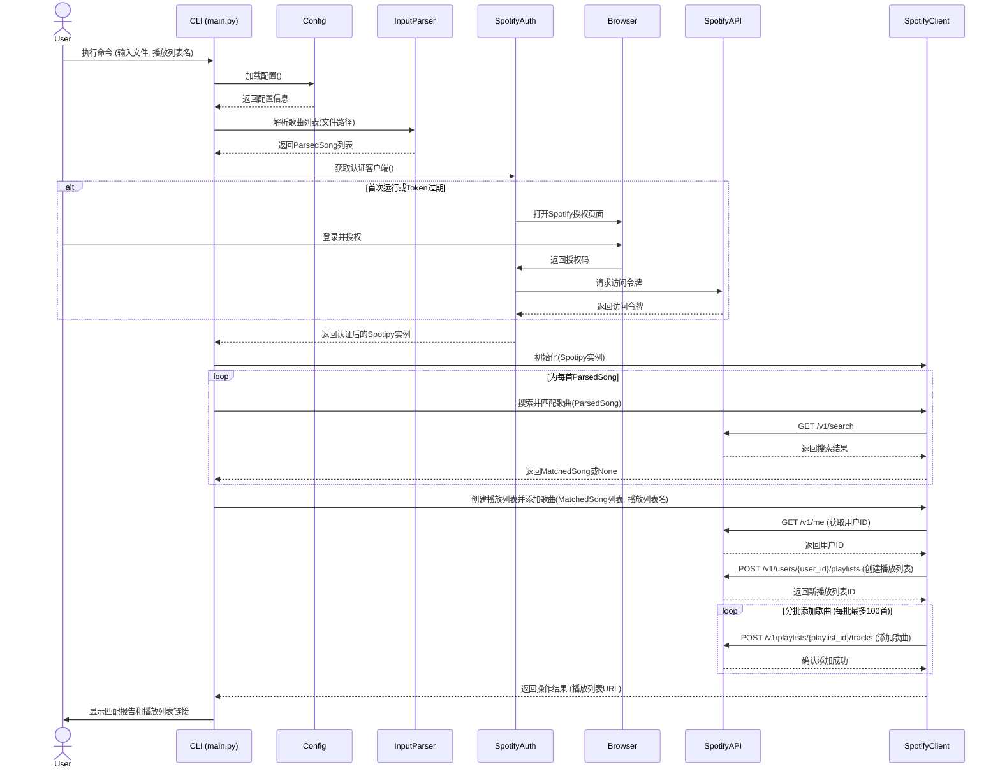

# Spotify 歌单导入工具架构文档

## 技术概要

本项目旨在开发一个 Python 命令行界面 (CLI) 工具，用于帮助用户将其本地文本文件中的歌曲列表导入到 Spotify。该工具的核心功能包括：解析用户提供的歌曲列表（每行格式为“歌曲名称 - 艺人”），通过 Spotify API 搜索并匹配这些歌曲，然后在用户的 Spotify 账户中创建一个新的播放列表，并将所有成功匹配的歌曲添加进去。架构上，它是一个单体 CLI 应用，主要依赖 `spotipy` 库与 Spotify API 进行交互，并采用模块化设计以分离不同的核心功能，如输入解析、Spotify API 通信和用户认证。

## 高层概览

本应用采用单体命令行应用程序的架构风格。用户通过命令行启动程序，提供输入文件和可选参数。程序随后执行认证、解析、搜索、匹配和播放列表创建等一系列操作，最终将结果反馈给用户。

主要用户交互和数据流如下：

```mermaid
graph TD
    A[用户 CLI 输入: 文件路径, 播放列表名称等] --> B{主应用程序逻辑};
    B --> C[1. 输入解析模块: 解析歌曲文件];
    C --> D[2. Spotify认证模块: 用户授权];
    D --> E[3. Spotify交互模块: 搜索歌曲];
    E --> F[4. 歌曲匹配与结果汇总模块: 编译匹配列表];
    F --> G[5. Spotify交互模块: 创建播放列表并添加歌曲];
    G --> H[用户反馈: 输出匹配报告和结果];

    subgraph核心处理流程
        direction LR
        C -- 解析后的歌曲列表 --> E;
        D -- 认证成功: Spotify客户端 --> E;
        D -- 认证成功: Spotify客户端 --> G;
        E -- 匹配的歌曲URI列表 --> G;
    end

    style A fill:#f9f,stroke:#333,stroke-width:2px
    style B fill:#bbf,stroke:#333,stroke-width:2px
    style H fill:#lightgreen,stroke:#333,stroke-width:2px
````

## 组件视图

系统主要由以下逻辑组件构成，它们协同工作以完成任务：

```mermaid
graph TD
    CLI[命令行接口 (main.py)] --> Config[配置加载模块 (core/config.py)];
    CLI --> InputParser[输入解析模块 (core/input_parser.py)];
    CLI --> SpotifyAuth[Spotify认证模块 (spotify/auth.py)];
    CLI --> SpotifyClient[Spotify API客户端 (spotify/client.py)];
    
    InputParser -- 解析后的歌曲对象列表 --> SpotifyClient;
    SpotifyAuth -- 认证后的Spotipy实例 --> SpotifyClient;
    SpotifyClient -- 匹配结果 --> CLI;
    SpotifyClient -- 播放列表操作结果 --> CLI;

    subgraph "核心模块 (core/)"
        direction TB
        Config;
        InputParser;
        Models[数据模型 (core/models.py)];
    end

    subgraph "Spotify模块 (spotify/)"
        direction TB
        SpotifyAuth;
        SpotifyClient;
    end
    
    Models -- 被各模块使用 --> InputParser;
    Models -- 被各模块使用 --> SpotifyClient;

    style CLI fill:#lightblue,stroke:#333,stroke-width:2px
    style Config fill:#lightgrey,stroke:#333,stroke-width:1px
    style InputParser fill:#lightyellow,stroke:#333,stroke-width:1px
    style SpotifyAuth fill:#lightgreen,stroke:#333,stroke-width:1px
    style SpotifyClient fill:#lightgreen,stroke:#333,stroke-width:1px
    style Models fill:#lightgrey,stroke:#333,stroke-width:1px
```

  * **`main.py` (命令行接口)**:
      * **职责**: 作为应用程序的入口点，负责解析命令行参数，协调其他组件完成整个流程，并向用户提供反馈。
      * **交互**: 调用配置加载、输入解析、认证和 Spotify 客户端等模块。
  * **`core/config.py` (配置加载模块)**:
      * **职责**: 从 `.env` 文件或环境变量中加载和管理应用程序的配置信息，主要是 Spotify API 的凭据 (`CLIENT_ID`, `CLIENT_SECRET`, `REDIRECT_URI`)。
      * **交互**: 被 `main.py` 调用以获取配置。
  * **`core/input_parser.py` (输入解析模块)**:
      * **职责**: 读取用户提供的文本文件，按照 "歌曲名称 - 艺人1 / 艺人2" 的格式解析每一行，并将其转换为内部的 `ParsedSong` 数据结构。
      * **交互**: 被 `main.py` 调用，解析结果传递给 `SpotifyClient` 进行处理。
  * **`core/models.py` (数据模型模块)**:
      * **职责**: 定义应用程序中使用到的核心数据结构，如 `ParsedSong` (解析后的歌曲信息), `MatchedSong` (匹配到的 Spotify 歌曲信息), 和 `MatchResult` (单首歌曲的匹配结果)。
      * **交互**: 被输入解析模块、Spotify 客户端模块等用于数据表示和传递。
  * **`spotify/auth.py` (Spotify认证模块)**:
      * **职责**: 处理与 Spotify API 的 OAuth 2.0 用户认证流程。使用 `spotipy` 库引导用户完成授权，并获取和管理 API 访问令牌。
      * **交互**: 被 `main.py` 调用，在需要与 Spotify API 交互前确保用户已认证。认证成功后返回一个配置好的 `spotipy.Spotify` 客户端实例。
  * **`spotify/client.py` (Spotify API客户端)**:
      * **职责**: 封装所有与 Spotify Web API 的直接交互逻辑。这包括搜索歌曲、获取歌曲详情、创建新的播放列表以及将歌曲添加到播放列表。
      * **交互**: 接收认证模块提供的 `spotipy` 实例和输入解析模块提供的歌曲列表。执行 API 调用，并将结果（如匹配的歌曲、新播放列表信息）返回给 `main.py` 进行处理和展示。

## 关键架构决策与模式

  * **编程语言与核心库**:
      * **Python**: 选择 Python 是因为它简洁易学，拥有强大的生态系统，并且非常适合编写脚本和 CLI 工具。
      * **`spotipy`**: 这是与 Spotify API 交互的首选 Python 库，它封装了认证和 API 调用的复杂性。
      * **`python-dotenv`**: 用于安全地管理 API 密钥等敏感配置信息，避免硬编码。
      * **CLI 框架 (如 `Click` 或 `Typer`)**: 用于构建结构清晰、用户友好的命令行界面，简化参数解析和帮助信息的生成。
  * **架构风格**:
      * **单体命令行应用**: 鉴于项目的功能范围和目标用户，单体 CLI 应用是最直接和合适的架构。它易于开发、部署和使用。
  * **认证机制**:
      * **OAuth 2.0 (Authorization Code Flow with PKCE)**: 由 `spotipy` 库支持，是 Spotify API 推荐的针对桌面/CLI 应用的用户认证流程，安全性较高。
  * **模块化设计**:
      * 尽管是单体应用，但代码按功能划分为不同的模块（如 `core`, `spotify`），每个模块负责特定的职责（配置、输入处理、认证、API 交互）。这有助于提高代码的可维护性、可读性和可测试性。
  * **错误处理**:
      * 应用将包含明确的错误处理逻辑，捕获 API 调用错误、文件处理错误、认证失败等，并向用户提供有意义的反馈。
  * **配置管理**:
      * 敏感信息（API 密钥）通过 `.env` 文件管理，与代码分离，增强安全性。

## 核心工作流 / 序列图 (可选)

以下是一个简化的主要工作流程序列图：



## 基础设施和部署概述

  * **云提供商**: 无特定云提供商依赖，因为这是一个本地运行的 CLI 工具。
  * **核心服务使用**: 主要依赖 Spotify Web API。
  * **基础设施即代码 (IaC)**: 不适用。
  * **部署策略**: 用户通过下载源代码、安装依赖并在本地 Python 环境中运行。可选地，可以使用 `PyInstaller` 或 `cx_Freeze` 打包成独立的可执行文件进行分发。
  * **环境**: 主要为用户的本地开发/运行环境。

## 关键参考文档

  * `README.md` (项目根目录)
  * `docs/tech-stack.md`
  * `docs/project-structure.md`
  * `docs/coding-standards.md`
  * `docs/api-reference.md` (Spotify API 部分)
  * `docs/data-models.md`
  * `docs/environment-vars.md`
  * `docs/testing-strategy.md`
  * 用户提供的 `prd.md` (原始需求文档，已根据实际情况调整范围)

## 变更日志

| 变更描述                                     | 日期       | 版本 | 作者     |
| -------------------------------------------- | ---------- | ---- | -------- |
| 初稿，基于Spotify-only方案                   | 2025-05-17 | 0.1  | 3-Architect |
| ...                                          | ...        | ...  | ...      |

```

---

这份架构文档提供了项目的整体视图和关键组件的职责。
